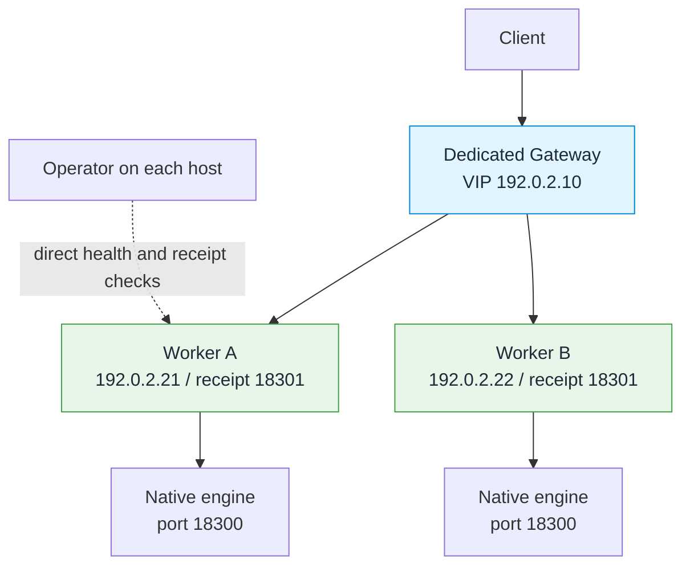

```mermaid
flowchart TD
    C["Client"] --> G["Dedicated Gateway<br/>VIP 192.0.2.10"]
    G --> A["Worker A<br/>192.0.2.21 / receipt 18301"]
    G --> B["Worker B<br/>192.0.2.22 / receipt 18301"]
    A --> NA["Native engine<br/>port 18300"]
    B --> NB["Native engine<br/>port 18300"]
    O["Operator on each host"] -.->|"direct health and receipt checks"| A
    style G fill:#e1f5fe,stroke:#0288d1,color:#1f2937
    style A fill:#e8f5e9,stroke:#43a047,color:#1f2937
    style B fill:#e8f5e9,stroke:#43a047,color:#1f2937
```
