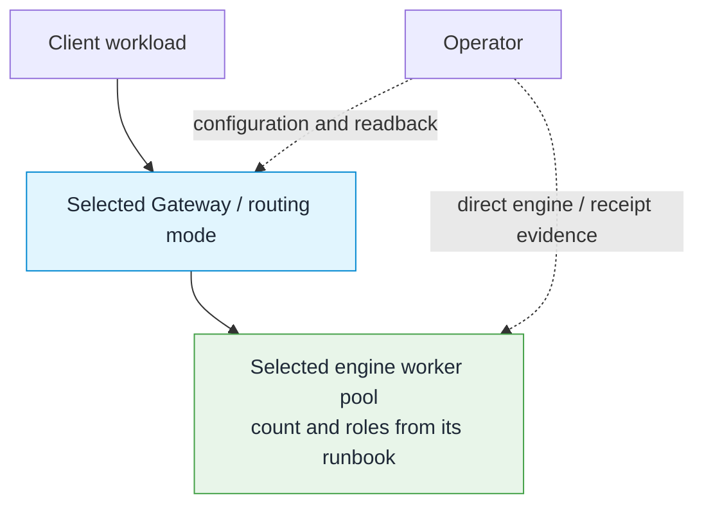

```mermaid
flowchart TD
    C["Client workload"] --> G["Selected Gateway / routing mode"]
    G --> W["Selected engine worker pool<br/>count and roles from its runbook"]
    O["Operator"] -.->|"configuration and readback"| G
    O -.->|"direct engine / receipt evidence"| W
    style G fill:#e1f5fe,stroke:#0288d1,color:#1f2937
    style W fill:#e8f5e9,stroke:#43a047,color:#1f2937
```
