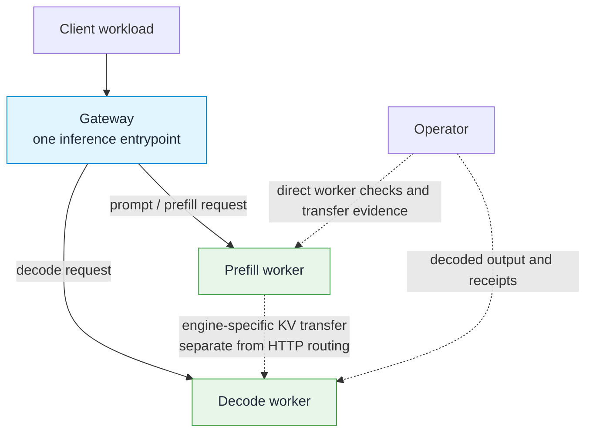

```mermaid
flowchart TD
    C["Client workload"] --> G["Gateway<br/>one inference entrypoint"]
    G -->|"prompt / prefill request"| P["Prefill worker"]
    G -->|"decode request"| D["Decode worker"]
    P -.->|"engine-specific KV transfer<br/>separate from HTTP routing"| D
    O["Operator"] -.->|"direct worker checks and transfer evidence"| P
    O -.->|"decoded output and receipts"| D
    style G fill:#e1f5fe,stroke:#0288d1,color:#1f2937
    style P fill:#e8f5e9,stroke:#43a047,color:#1f2937
    style D fill:#e8f5e9,stroke:#43a047,color:#1f2937
```
