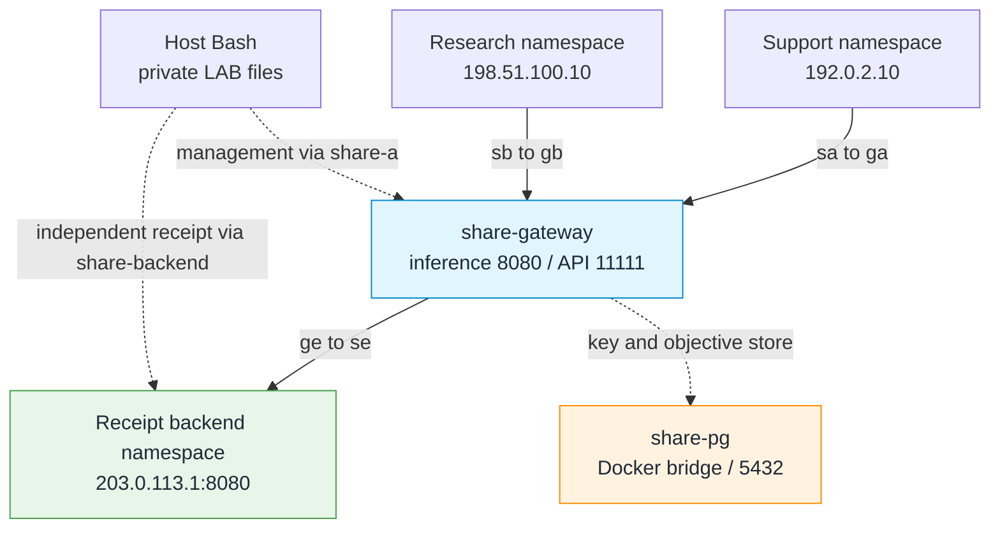

```mermaid
flowchart TD
    A["Support namespace<br/>192.0.2.10"] -->|"sa to ga"| G["share-gateway<br/>inference 8080 / API 11111"]
    B["Research namespace<br/>198.51.100.10"] -->|"sb to gb"| G
    G -->|"ge to se"| E["Receipt backend namespace<br/>203.0.113.1:8080"]
    G -.->|"key and objective store"| P["share-pg<br/>Docker bridge / 5432"]
    O["Host Bash<br/>private LAB files"] -.->|"management via share-a"| G
    O -.->|"independent receipt via share-backend"| E
    style G fill:#e1f5fe,stroke:#0288d1,color:#1f2937
    style E fill:#e8f5e9,stroke:#43a047,color:#1f2937
    style P fill:#fff3e0,stroke:#fb8c00,color:#1f2937
```
